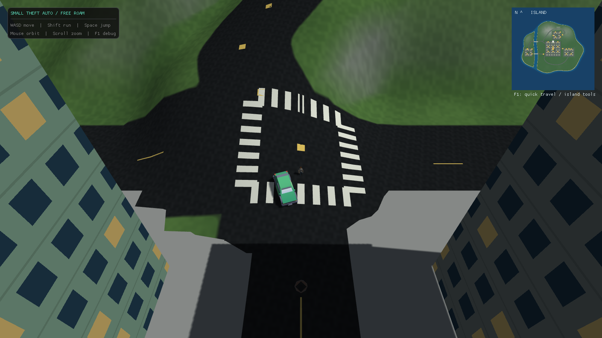
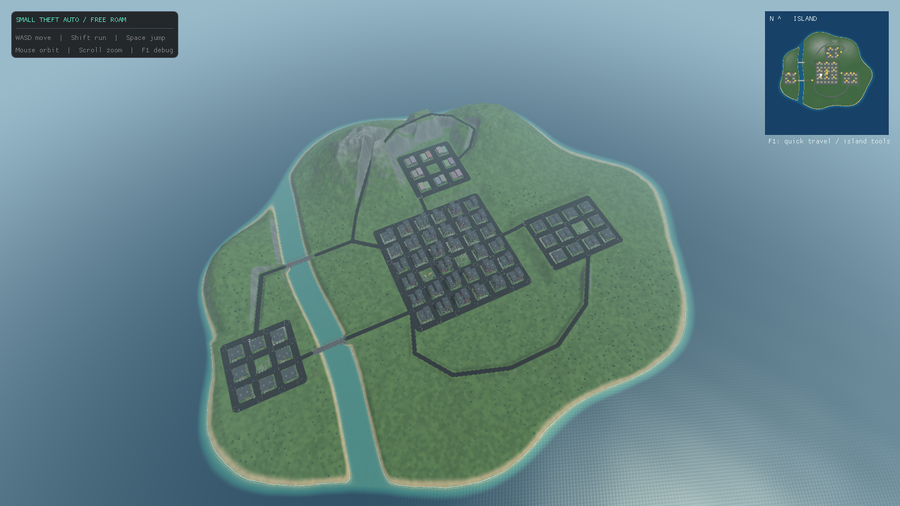
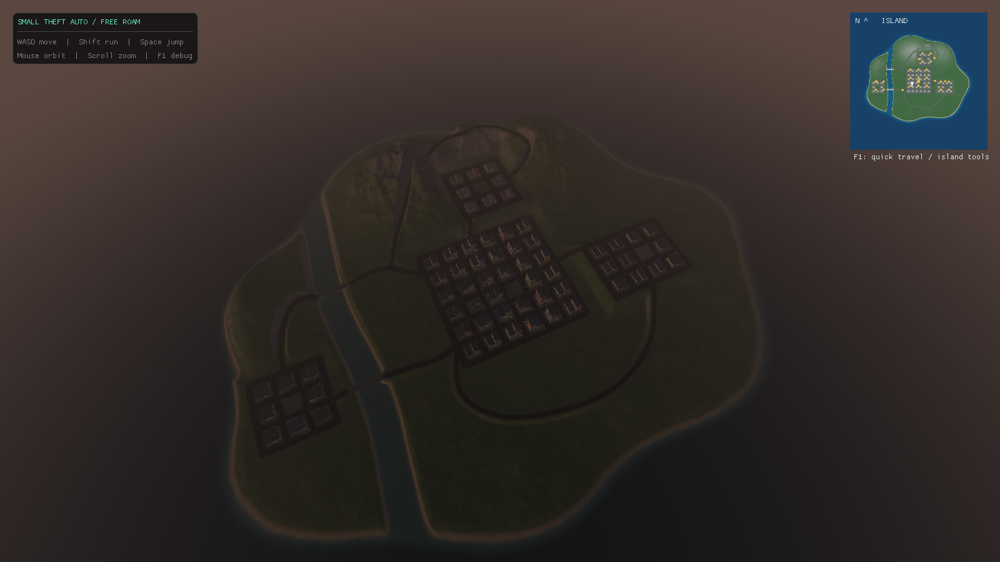
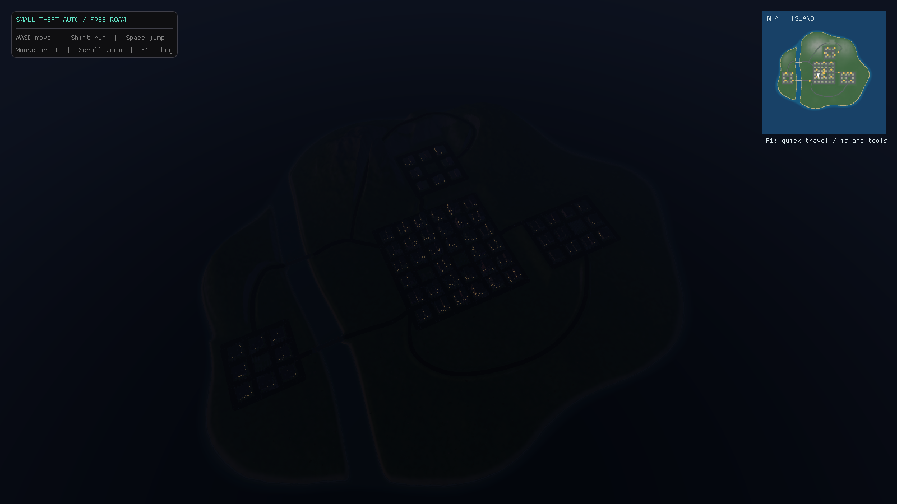

# sTA

sTA (small Theft Auto) is a small GTA-inspired C++ / OpenGL sandbox. The engine and game are built from scratch as a learning project, with imported character, vehicle, tree and street-prop models.




## Harbor Island

The playable map is a **saved 2,048 × 2,048 metre island heightfield**, with an irregular coast, beaches, a tidal channel and mountain peaks around 175 metres. Terrain, roads, buildings, scenery and patrol routes are baked into versioned assets. **The game never generates terrain at startup.**



- Four districts: Downtown at 8 metres, East gardens at 26 metres, Highland at 32 metres, and West harbor across the channel. There are 122 buildings with varied heights and procedural façades.
- Authored roads connect the districts, southern parkland, winding mountain road and lookout, sampled through Catmull-Rom splines into 459 segments so the rural links and the mountain road curve instead of running ruled. Two raised bridges cross real water, with open passage underneath.
- Road coverage is baked on its own 2,049 x 2,049 grid, four times finer than the terrain, so a five-metre mountain road has edges rather than staircase steps. Crossings and centre lines are surface records the loader lays over the terrain, so they follow every camber and grade.
- Parks, wooded hills, beaches, piers, sidewalks, crossings, awnings and rooftop equipment. Terrain shading blends grass, sand, exposed rock and asphalt.
- About 1,300 scanned street props - lamps, hydrants, benches, bins, utility boxes, barriers, a tarpaulin-covered car - placed along the road network at load time, on a regular cadence for the lamps and at random for the clutter. Placement walks outward from the carriageway until the ground steps up, so furniture stands on the pavement rather than the verge, and is skipped at junction mouths.
- Animated waves and ripples, depth-dependent water color, Fresnel/specular highlights and moving shoreline foam. The ocean recenters around the camera beyond the island, avoiding a visible edge. [Shoreline preview](docs/shore.png).
- Thirty vehicles (six parked, 24 AI), using 19 models, and 34 animated pedestrians using eight Quaternius models. Inter-district traffic crosses the bridges and follows the mountain and coastal roads.
- Basic swimming keeps the player afloat, with slower movement in deep water. Submerged cars recover to a clear starting-street position, keeping exploration playable.
- A north-up island minimap and an Island debug page with an aerial camera. Player quick travel includes the beach, west bridge, Highland and mountain lookout.
- Optional courier missions: F1 → Missions → **Start courier run** or **Start and play**. Stop in the teal marker for 1.5 seconds to earn $150. Five destinations now cover multiple districts. Progress lasts for the current session.

### Rebuilding the map deliberately

```sh
python3 tools/build_island.py
cmake --build out/build/linux-debug
ctest --test-dir out/build/linux-debug --output-on-failure
```

The authoring tool uses only Python's standard library: seeded fractal value noise, coastline and mountain shaping, and graded road/terrace earthworks. The build only copies the saved assets; it does **not** invoke the generator. Edit the tool's district and road definitions, then regenerate when you want a different map. For experiments, use `--output /tmp/island-preview` to keep the playable asset intact. See [the map format and authoring notes](resources/maps/README.md).

## Sky, sun and shadows

The sky is an analytic single-scattering model - Rayleigh and Mie, evaluated per fragment - so sunrise and sunset colours fall out of the same maths that makes midday blue. A clock drives the sun's position, the direct and ambient light colours and the distance haze; building windows light up after dusk. A wind-driven cloud layer sits over it. Cloud cover, density, wind, the hour and the clock rate are all on the Rendering debug page.





Shadows come from one 4,096 x 4,096 map fitted around whatever the player is controlling, sampled through a comparison sampler so each of sixteen taps is itself a hardware 2x2 comparison, with per-pixel kernel rotation. Bias is normal-offset rather than depth-slope, and the light matrix is snapped to whole shadow texels so static edges do not crawl as the camera moves.

## Movement and collisions

Buildings are merged into spatial batches before distance culling. Trees and street props are instanced instead - one copy of each model's geometry and a per-frame buffer of the matrices that survive culling - which is what keeps 1,162 trees and 1,300 props affordable. A spatial index limits static collision queries to nearby objects. Terrain loads in mesh chunks; none of this changes the baked map layout.

Vehicles use upright oriented boxes with separating-axis collision checks; their hitboxes match their heading without ballooning diagonally. Steering cannot rotate a car into a wall. Character footprints stay stable while their bodies turn. Movement uses small substeps and slides along obstacles.

Both ramps have outward-facing geometry, walkable slopes and solid high ends. Ground following has bounded step heights, supports sidewalk edges and falls naturally off ledges. Vehicle bodies tilt to match slopes while their collision boxes remain upright for arcade handling. The camera shortens its orbit around static obstacles. Vehicle exits check both sides and the rear for safe ground and clearance.

This is still a prototype: traffic follows fixed routes and stops at obstructions; it does not reroute, obey traffic lights or react to crimes. Water is a visual wave/foam effect with basic gameplay buoyancy, not a fluid simulation or scene-reflection system. There are no boats, police behavior, combat, audio or save files yet. Police and emergency vehicles currently behave like ordinary traffic. Street lamps are decorative.

## Imported models

The player is Quaternius's Casual Character with idle/walk/run animation blending.
Pedestrians cycle through four men and four women, walking along their saved routes
and idling when blocked. Animation clocks follow simulation time and pause with the game;
the main and shadow passes share each actor's skinned pose.

[Character contact sheet](docs/models-characters.png) · [19 vehicles](docs/models-cars.png) · [12 trees](docs/models-trees.png)

Trees and street props are Poly Haven photogrammetry scans, rebuilt for real-time use by
`tools/import_polyhaven.py`: the wood is simplified with meshoptimizer and the canopy is
replaced with textured leaf cards sampled from the scan's own leaf positions, because no
general-purpose simplifier can thin half a million individually modelled leaves without
leaving a bare skeleton.

Everything bundled here is CC0 **except** `cars/porsche-930.glb`, which was supplied
locally and whose licence is unknown - it is recorded as such in the manifest, and a real
car marque is a trademark question separate from any asset licence. See
[sources, licenses and hashes](resources/models/README.md).
Cars keep their source proportions, with collision bounds derived from their model size.
Trees retain solid trunk colliders; repeated trees and street props use shared GPU
meshes and instanced draws.
The terrain, road layout and actor routes are unchanged by the asset replacement.

The loader uses cgltf 1.15 (MIT), GPU skeletal skinning, quaternion interpolation and
short animation crossfades. It supports the selected assets' linear/step animation,
skins, node transforms, vertex colors, palette colors, material textures, alpha cutouts
and normal maps. It is not a full glTF/PBR renderer: morph targets and cubic-spline
animation need additional support. All original clips remain in the character files,
but gameplay currently uses locomotion clips; bespoke jump, swim and vehicle-entry
animations and rotating wheels are not implemented.

## Building

### Linux

Requires CMake, Ninja, GLFW and OpenGL development libraries.

```sh
cmake -S . -B out/build/linux-debug -G Ninja -DCMAKE_BUILD_TYPE=Debug
cmake --build out/build/linux-debug
cd out/build/linux-debug
./sTA
```

Run from the build directory so the game finds its copied `resources/` folder.

### Windows

Open the folder in Visual Studio with CMake integration and build the x64-Debug configuration. Supply a static `glfw3.lib` in `lib/`; it is not checked in.

## Controls

| Key | Action |
|---|---|
| W / A / S / D | Camera-relative walking/swimming; throttle / steer / brake and reverse in a car |
| Shift | Run on foot |
| Space | Jump on foot; handbrake in a car |
| F | Enter a nearby stopped car; exit at low speed if there is room |
| Mouse / scroll | Orbit camera / zoom |
| F1 | Pause simulation and open debug panels |
| Esc | Quit |

Debug builds open the debug UI automatically with simulation paused and the cursor free. Release and other build configurations start in free roam with the UI hidden. F1, the close button or **Resume game** returns to play.

The debug window has a sidebar with Overview, Missions, Player, Camera, Island, Rendering and Vehicle pages. Use Tab / arrows and Enter for keyboard navigation. Tools include movement/camera resets, safe on-foot quick travel, an aerial island view, wave strength, time of day and cloud settings, inspection and tuning of any vehicle, spawning a Porsche ahead of the player, HUD visibility, shadow controls, and collision volumes. Starting a courier run resets its progress; stopping it removes the mission HUD and markers while retaining earnings in the Missions page until the next run.

## Performance

Character meshes and material textures are loaded once and reused. Skinning runs in
vertex shaders; only bone palettes change during play. Materials sharing a skeleton
also share its palette, including between the color and shadow passes. GPU poses are
checked against a CPU reference in the model tests.

Camera-frustum and light-frustum tests cull actors, scenery and terrain chunks before
drawing. Off-screen characters that cannot cast visible shadows skip pose evaluation.
Animation detail follows distance: full rate within 25 metres, 30 Hz beyond that, and
10 Hz beyond 75 metres. Physics and root movement remain at 60 Hz. Geometry LOD is not
yet implemented; repeated scenery is instanced and distance-culled.

The debug Overview retains timings for the last 120 gameplay frames, including the
95th percentile. Its current/menu FPS is separate, so pausing does not hide a slow
active frame. Render/present time includes VSync waits during ordinary play.

Run `./sTA --benchmark` from a build directory for an uncapped comparison of paused
and active downtown rendering. It warms each phase, measures 120 frames, waits for GPU
completion and reports the renderer, resolution, median/p95 frame time, simulation,
render submission/presentation, GPU wait, pose updates, culled model passes and palette
upload size. These measurements describe this camera/scene; they are not a guarantee
for every view. Use a Release build for representative gameplay performance.

## Verification

```sh
ctest --test-dir out/build/linux-debug --output-on-failure
cd out/build/linux-debug
./sTA --smoke-test
```

CTest runs without a display: it checks rotated collision clearance, ramp mesh winding, ramp ascent/descent, high-end blocking, jumping, curb stepping, fast wall collisions, two-minute block patrols, ten-minute inter-district traffic simulations and camera obstruction. It also checks the baked heightfield against rendered triangles and traverses every road/bridge in both directions. The optional smoke test needs a working display/OpenGL context; it opens a hidden window, checks build-specific UI startup, cursor mode, mission start/stop/restart, swimming, submerged-vehicle recovery and rendering. It also renders all 48 imported models in contact sheets (`smoke-characters.ppm`,
`smoke-characters-next.ppm`, `smoke-cars.ppm`, `smoke-trees.ppm`), with two character
animation times. The headless model test checks all clips, skin deformation,
normalized bounds, normals and crossfades. The island test checks that every
vehicle/tree variant is placed and that tree trunks remain solid. It writes `smoke-*.ppm` views of the debug UI, missions, the vehicle panel, the city, a hero
frame of a spawned Porsche, a graded junction, ramps, the island, dusk, night, the bridge and
the shore (including a second shore frame two seconds later) in the working directory. Shader compilation/link errors fail the run.

## Dependencies

glad, glm, stb_image, cgltf, Dear ImGui and GLFW headers are vendored in `include/`. Linux uses the system GLFW library; Windows uses the supplied `glfw3.lib`.
