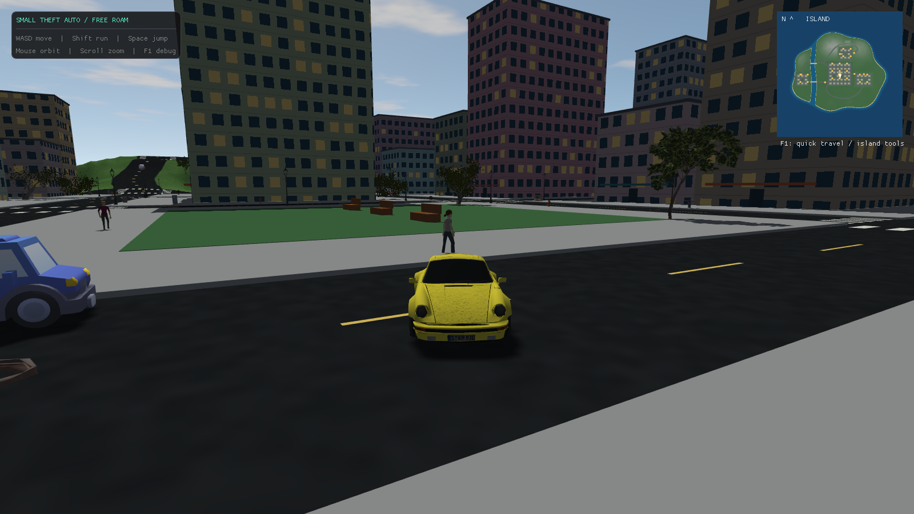

# sTA

sTA (small Theft Auto) is a [much] smaller GTA-like game written from scratch in C++. I'm using it to teach myself OpenGL and game programming. The plan is to loosely rebuild GTA 3, since it's the simplest of the 3D games, and grow the engine piece by piece as I learn.

Everything you see is placeholder geometry for now. The player is a cube. The cars are cubes. The buildings are, you guessed it, cubes.



## What works so far

- A walkable rectangular city block: asphalt ground, box buildings, border walls
- A playable character with GTA-style third-person camera (mouse orbits, scroll zooms)
- AABB collision that lets you slide along walls instead of walking through them
- Three drivable cars (sedan, taxi, van) with simple arcade physics: throttle, braking, speed-scaled steering
- Get in and out of any car within reach
- A debug menu (Dear ImGui) with live sliders for movement, camera, and vehicle physics, plus a collision-box wireframe view
- A fixed-timestep game loop, so the simulation runs the same regardless of framerate

Not yet: gravity, real models, sounds, or anything resembling a mission.

## Building

### Linux

Needs `cmake`, `ninja` and `glfw` from your package manager (tested on Arch/CachyOS).

```sh
cmake -S . -B out/build/linux-debug -G Ninja -DCMAKE_BUILD_TYPE=Debug
cmake --build out/build/linux-debug
cd out/build/linux-debug && ./sTA
```

Run it from the build directory, otherwise it won't find the `resources/` folder.

### Windows

Open the folder in Visual Studio with its CMake integration and build the x64-Debug configuration. You need a static `glfw3.lib` placed in `lib/` first; it's not checked into the repo.

## Controls

| Key | Action |
|---|---|
| W / A / S / D | Move (or drive, while in a car) |
| Shift | Run |
| F | Enter/exit the nearest car |
| Mouse | Orbit camera |
| Scroll | Zoom |
| F1 | Debug menu |
| Esc | Quit |

## Dependencies

glad, glm, stb_image, Dear ImGui, and the GLFW headers are vendored in `include/`, so there's nothing to fetch. On Linux the GLFW library itself comes from the system; on Windows you provide `glfw3.lib` yourself.
